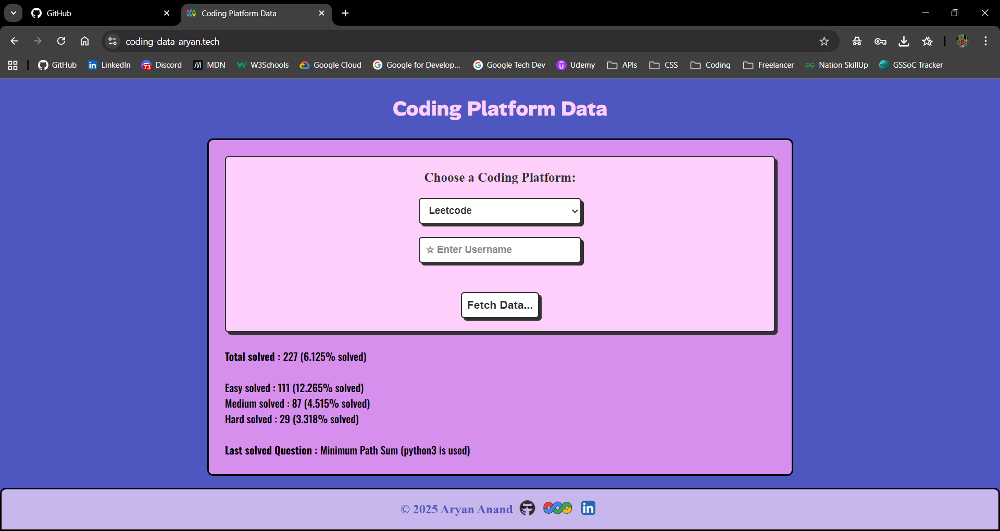

# 🚀 Coding Platform Data Fetcher

A sleek and responsive web application that fetches real-time statistics for various coding platforms. Currently, it provides detailed insights for **LeetCode** users, with more platforms like AtCoder, CodeChef, and Codeforces coming soon.

---

## 📸 Preview


_Home Screen with Platform Selection_


_Dynamic Data Fetching Example_

---

## ✨ Features

- **Real-time Data**: Fetches live statistics directly from coding platforms.
- **Detailed Breakdown**: Shows total solved problems along with Easy, Medium, and Hard difficulty distributions.
- **Percentage Analytics**: Calculates the percentage of problems solved relative to the total available.
- **Recent Activity**: Displays the last solved question and the language used.
- **Modern UI**: Built with a focus on typography and clean design using Google Fonts (Alan Sans, Montserrat, Oswald).
- **Responsive Design**: Works across different screen sizes.

---

## 🛠️ Technologies Used

- **Frontend**: HTML5, CSS3, JavaScript (ES6+)
- **API Integration**: Fetch API for asynchronous data retrieval.
- **Fonts**: [Google Fonts](https://fonts.google.com/) (Alan Sans, Montserrat, Oswald, Luckiest Guy)
- **Icons**: Custom assets for GitHub, LinkedIn, and Google.

---

## 🚀 Getting Started

### Prerequisites

To run this project locally, you only need a modern web browser.

### Installation

1. **Clone the repository:**

   ```bash
   git clone https://github.com/aryan-anand-sde/Coding-Platform-Data.git
   ```

2. **Navigate to the project directory:**

   ```bash
   cd Coding-Platform-Data
   ```

3. **Open `index.html`:**
   Simply double-click the `index.html` file or use a Live Server extension in VS Code.

---

## 🔮 Roadmap

- [x] LeetCode Integration
- [ ] AtCoder Integration
- [ ] CodeChef Integration
- [ ] Codeforces Integration
- [ ] GeeksforGeeks Integration
- [ ] Data Visualization (Charts & Graphs)

---

## 🤝 Contributing

Contributions are what make the open-source community such an amazing place to learn, inspire, and create. Any contributions you make are **greatly appreciated**.

1. Fork the Project
2. Create your Feature Branch (`git checkout -b feature/AmazingFeature`)
3. Commit your Changes (`git commit -m 'Add some AmazingFeature'`)
4. Push to the Branch (`git push origin feature/AmazingFeature`)
5. Open a Pull Request

---

## 👨‍💻 Author

### Aryan Anand

- [Portfolio](https://www.aryananand.me/)
- [GitHub](https://github.com/aryan-anand-sde)
- [LinkedIn](https://www.linkedin.com/in/aryan-anand-sde/)
- [Google Developer Profile](https://developers.google.com/profile/u/aryananand25)

---

&copy; 2025 Aryan Anand. All rights reserved.
